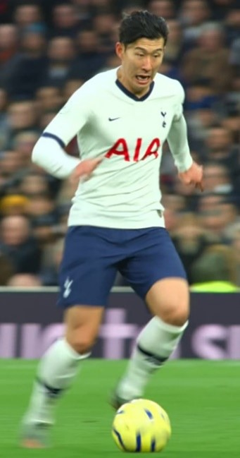
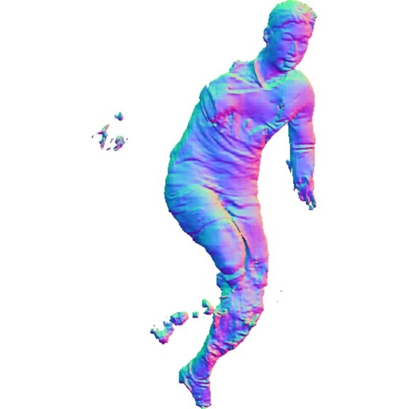
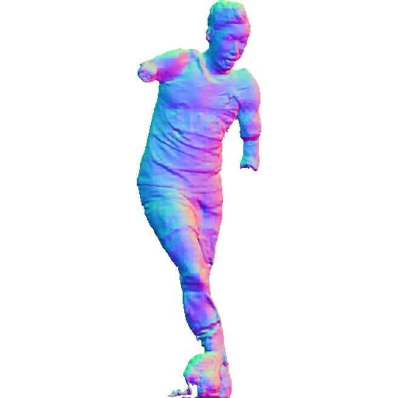
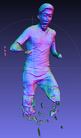
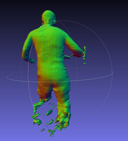
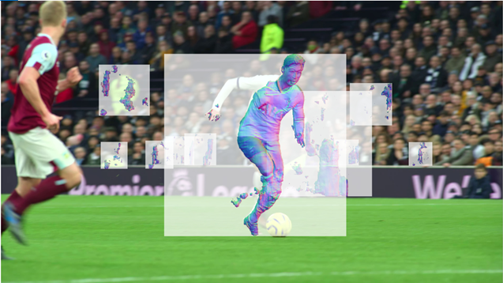
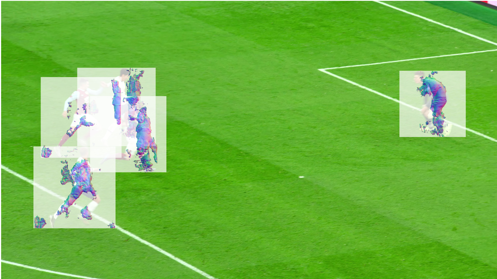

# soccer-pifu

This repo is an example of applying pifuHD in soccer videos.

pifuHD reference : https://github.com/facebookresearch/pifuhd

# Results

# Installing pifuHD in Windows

you can install PIFuHD in linux easily, but there are some modifications needed for windows installation

of course, windows installation is not mandatory for the purpose of this repo

- install git bash, execute `C:\Program Files\Git\bin\bash.exe`
- add conda to path, then activate by `eval "$(conda shell.bash hook)"`
- install needed dependencies by pifu using conda, you might need to put `freeglut.dll` `C:/Windows/System32` 
- run `sh ./scripts/download_trained_model.sh` to download models for pifuHD
- download openpose from https://github.com/CMU-Perceptual-Computing-Lab/openpose/releases, execute  `openpose/models/getModels.bat`  to download models for openpose
- in `apps/batch_openpose.py` , change `cmd = "cd {0}; ./build/examples/openpose/openpose.bin --image_dir {1} --write_json {2} --render_pose 2 --face --face_render 2 --hand --hand_render 2".format(op_dir, input_path, out_json_path)`  to `cmd = "cd {0} && .\\bin\\OpenPoseDemo.exe --image_dir {1} --write_json {2} --render_pose 2 --face --face_render 2 --hand --hand_render 2".format(op_dir, input_path, out_json_path) ` 
- in `scripts/demo.sh`, add something like  `python apps/batch_openpose.py -d openpose/ -i C:/Users/haebin/Desktop/3d2d/pifuhd-master/sample_images -o C:/Users/haebin/Desktop/3d2d/pifuhd-master/sample_images` in the top (we need to perform pose estimation for pifuHD's input)
- run `sh scripts/demo.sh` 

# Installing yolov5 for human detection

You could either give input of rectangles or pose estimation results for the cropping reference of pifuHD. Above I showed an example of using openpose for using pose estimation results (which is also stated in pifuHD's repo). But for this project, I found it more convenient use bounding box rectangle inputs for cropping, since I can easily overlay the image. Thus I used yolov5 for human detection, and gave the input of bounding boxes.

yolov5 : https://github.com/ultralytics/yolov5

# Scripts

extract_frame.py

- extract frames from video

`python detect.py --source ../frame --weights yolov5s.pt`

- `detect.py` from yolov5 repo (not in this repo)
- put output to `./detection`

make_rect.py

- change xyxy -> xywh (xyrr)
- square image is required by pifuHD

pifu.py

- use pifu for 3d human model generation

projection.py

- project 3d human model into 2d image for visualization

overlay.py

- overlay image for visualization

merge_frame.py

- merge overlayed images for visualization

# Limitations

sadly, the results are not that decent, mainly due to the limitations of the model pifuHD.

here are the official limitations of pifuHD (some are due to the training data)

- Use high-res image. The model is trained with 1024x1024 images. Use at least 512x512 with fine-details. Low-res images and JPEG artifacts may result in unsatisfactory results.
- Use an image with a single person. If the image contain multiple people, reconstruction quality is likely degraded.
- Front facing with standing works best (or with fashion pose)
- The entire body is covered within the image. (Note: now missing legs is partially supported)
- Make sure the input image is well lit. Exteremy dark or bright image and strong shadow often create artifacts.
- I recommend nearly parallel camera angle to the ground. High camera height may result in distorted legs or high heels.
- If the background is cluttered, use less complex background or try removing it using https://www.remove.bg/ before processing.
- It's trained with human only. Anime characters may not work well (To my surprise, indeed many people tried it!!).

sadly, many of those limitations apply to soccer videos.

There are also some mismatch in overlay, probably because of the projection and resizing that we perform for overlay. This maybe due to pifu's mechanism, but we can probably fix it by getting camera parameters of the soccer field and finding out the exact location of the players.

# Possible Improvements

reduce motion blur so that we have an accurate image, not a blurry one

- but it is hard to remove motion blur from dynamic sports images

retrain model using various perspective images

- we need datasets for that type of image

using 3d pose estimation, tune the threshold of surface classifier

- 3d pose estimation is quite accurate on even blurry images, so we use that result for the pixel aligned implicit classification function which classifies surface inside/outside

use better resolution in pifuHD
- I used 512x512 (default) resolution, due to memory resource limitations, but I bet we could get some better results in higher resolution since we have 8k soccer videos
